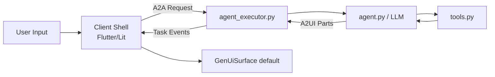

# 02. End-to-End 흐름 추적

## 한눈에 보는 흐름

## 코드 기준 추적 순서

1. 클라이언트 입력
   - Flutter: `samples/client/flutter/restaurant_shell/lib/main.dart`
2. 서버 엔트리포인트
   - `samples/agent/adk/restaurant_finder/__main__.py`
3. 요청 해석/상태 전송
   - `samples/agent/adk/restaurant_finder/agent_executor.py`
4. LLM + A2UI 검증/재시도
   - `samples/agent/adk/restaurant_finder/agent.py`
5. 데이터 도구 호출
   - `samples/agent/adk/restaurant_finder/tools.py`

## 왜 executor가 중요한가

`agent_executor.py`는 단순 전달자가 아니라,

- `TextPart` vs `DataPart(userAction)` 분기
- Flutter 호환을 위한 surface remap
- booking form 값 보정(book_ctx 주입)

같은 **실전 안정화 로직**을 포함합니다.

## 학습 체크포인트

- [ ] `action == "book_restaurant"` 경로를 말로 설명할 수 있다.
- [ ] `submit_booking`일 때 왜 `TaskState.completed`가 되는지 이해한다.
- [ ] Flutter에서 `surfaceId='default'` 리매핑 이유를 설명할 수 있다.

