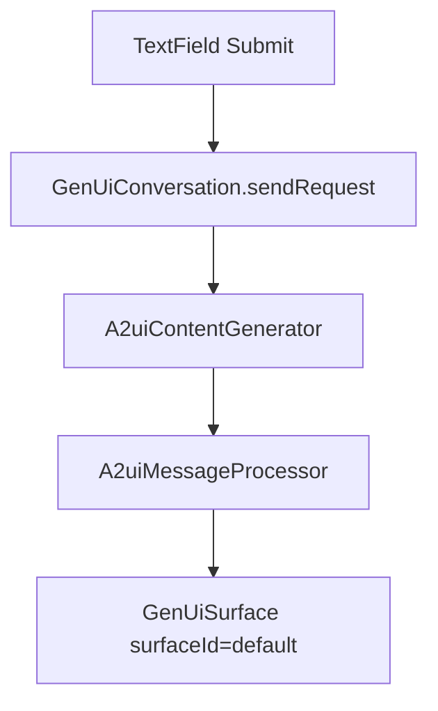

# 04. 클라이언트 렌더링 이해

## Flutter Shell 핵심

- 파일: `samples/client/flutter/restaurant_shell/lib/main.dart`
- 설정: `samples/client/flutter/restaurant_shell/lib/config/app_config.dart`
- 의존성: `samples/client/flutter/restaurant_shell/pubspec.yaml`

## 렌더링 흐름

## 주요 포인트

- `A2uiContentGenerator`: 서버 통신/응답 스트림 수신
- `A2uiMessageProcessor`: A2UI 파트를 surface 상태로 변환
- `GenUiSurface(host, surfaceId)`: 실제 화면 렌더

## Android 주의점

- 에뮬레이터에서 host 머신 접근 시 `localhost` 대신 `10.0.2.2` 사용
- 관련 스크립트:
  - `demos/scripts/run-client-flutter-shell.sh`
  - `demos/run-demo-restaurant-flutter.sh`

## Lit/기타 클라이언트

- Lit shell: `samples/client/lit/shell`
- React shell: `samples/client/react/shell`
- Angular 샘플: `samples/client/angular`

학습 순서는 Flutter 하나를 먼저 이해한 뒤 다른 프레임워크를 비교하는 방식이 가장 빠릅니다.

